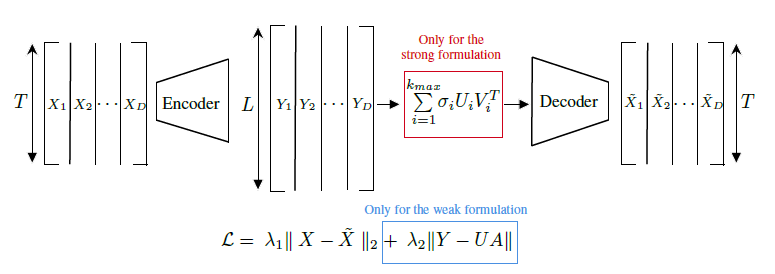

# Welcome
----------- NOTE THE WEAK METHOD IS NOT WORKING AT THE MOMENT ------------------------------------------------
This repository contains all the necessary codes for training and using RRAEs. The library contains multiple classes for different types of Autoencoders (including RRAEs, IRMAEs, LoRAEs, and Vanilla, all with both MLPs and CNNs). 

# What are RRAEs?

RRAEs or Rank reduction autoencoders are autoencoders with a long latent space that is enforced to have a low rank. The idea of RRAEs is to benefit from the length of the latent space to get better behavior (e.g. as proposed in the Koopman theory or the kPCA) while allowing feature extraction since a low rank is explicitly specified. Two formulations are used to enforce the low rank, these can be seen in the following,

As can be seen in the figure, the Strong formulation performs a truncated SVD in the latent space, while the weak formulation adds a penalty to the loss. For more details about RRAEs, the presenting paper can be found [here](for_paper/tex_NeurIPS/RRAEs-paper.pdf).

This library presents all the required classes for creating customized RRAEs and training them (other architectures such as IRMAE and LoRAE are also available). For a tutorial on how to use all the available classes, refer to this [jupyter notebook](tutorial.ipynb).

# Help in installation

Since most of the lab doesn't use Python, we provide this section to clarify how to install and use the library (pre-requisites, have python and pip installed, and have access to the library using an SSH Key).
1. Create a folder locally (on your PC), with any name you want.
2. Using an IDE (e.g. Visual Studio code), or your terminal, change the directory into your new folder (using ``cd`` command), and create a python virtual environment by using the following command ``python3 -m venv .venv``. Note that you might need to write the specific version of python (e.g. ``python3.18 -m ...``). This will create a folder named ``.venv`` inside your new folder, where you should install all your python libraries later on for this project.
3. Activate your virtual environment. This will be different depending on the operating system, but in all cases, you should have a ``(venv)`` sign in your terminal to the left after the following command:
  -  On a Mac or Linux: ``source .venv/bin/activate``.
  -  On Windows: ``.venv/Scripts/activate``.
4. Now when you ``pip install`` something, it is installed in your ``.venv`` folder. You can install the library by doing ``pip install git+https://github.com/JadM133/RRAEs.git`` (note: you have to have access to the library since it is private).
5. To make sure everything went well, run the tests! To do so, start by installing pytest as follows ''pip install -U pytest''. Then execute the following:
  -  On a Mac: ``pytest ./.venv/lib/3.XX/site-packages/RRAEs/tests/``. where XX is your python version.
  -  On Windows: ``pytest .\.venv\Lib\site-packages\RRAEs\tests\``.
If all the tests pass, you're good to go!
6. Give it a try, the best place to start is the [jupyter notebook](tutorial.ipynb).

